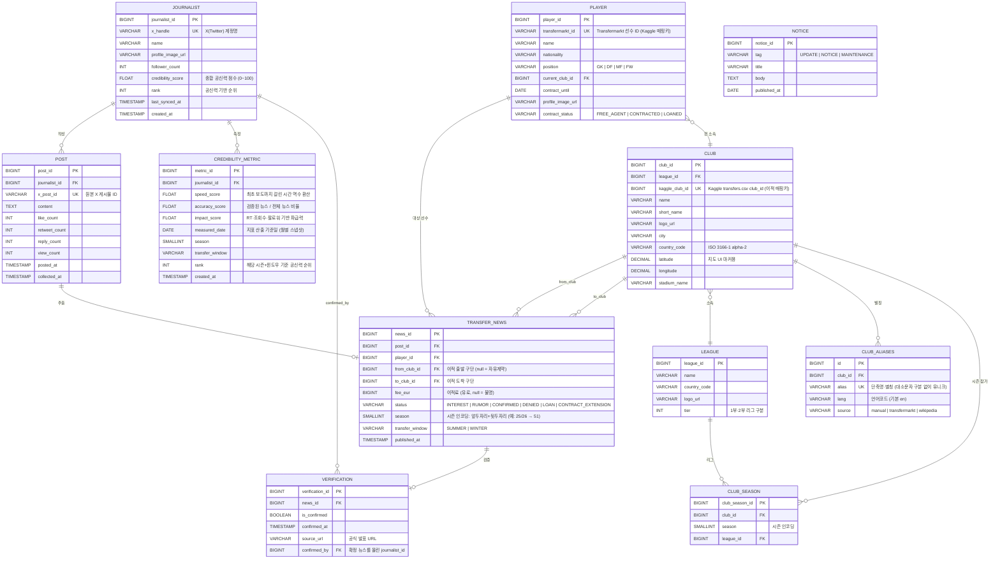

# E-R Diagram

## Concept
해외축구 이적시장 소식을 X(트위터)의 고신뢰 기자 게시물로 수집하고,
기사 등록 속도·정확도·파급력 기반으로 기자 공신력을 산출하여 유럽 지도 UI에 제공하는 서비스.

---

## 원천 데이터

| 출처 | 설명 | 대상 테이블 |
|------|------|-------------|
| **X API v2** | 기자 게시물 15분 주기 수집 (userId 기반) | JOURNALIST, POST, TRANSFER_NEWS |
| **Kaggle Transfermarkt** | 2000/01~2025/26 시즌 5대 리그 이적 이력 | TRANSFER_NEWS, PLAYER, CLUB |
| **수동 입력** | 구단 좌표·경기장·리그 메타 | CLUB, LEAGUE, CLUB_SEASON |

---

---

## 핵심 비즈니스 규칙

| 규칙 | 설명 |
|------|------|
| 공신력 점수 산출 | `credibility_score = speed_score × 0.3 + accuracy_score × 0.5 + impact_score × 0.2` |
| 정확도 측정 기준 | `status = CONFIRMED` & `VERIFICATION.is_confirmed = true` 건수 / 전체 뉴스 건수 |
| 속도 점수 | 동일 선수 이적 루머 중 `POST.posted_at` 최초 기자에게 높은 점수 |
| 파급력 점수 | `(retweet_count × 3 + like_count + view_count × 0.1) / follower_count` 정규화 |
| 지도 UI | `CLUB.latitude / longitude` 기준 마커, `to_club_id` 기준 이동 경로 시각화 |
| 자유계약 이적 | `TRANSFER_NEWS.from_club_id = NULL`, `fee_eur = 0` |
| 시즌 인코딩 | `season = 앞두자리 + 뒷두자리` — 25/26 → 51, 24/25 → 49. 홀수 패턴, 2씩 증가 |
| 이적 윈도우 | `SUMMER`: 6~9월 / `WINTER`: 1~2월. `published_at` 월 기준 자동 분류 |
| Kaggle 구단 매핑 | `CLUB.kaggle_club_id` = `transfers.csv`의 `from_club_id` / `to_club_id`. 직접 정수 매핑으로 이름 매칭 오류 방지 |
| 선수 중복 방지 | `PLAYER.transfermarkt_id` (UK) 기준으로 `WHERE NOT EXISTS` 패턴으로 삽입 |
| CLUB_SEASON 의미 | 특정 시즌에 해당 리그에 소속된 구단 기록. 강등/승격 이력 추적 가능 |
| 시즌별 기자 랭킹 | `CREDIBILITY_METRIC.rank` — 특정 `season + window` 조합 기준 순위 |
