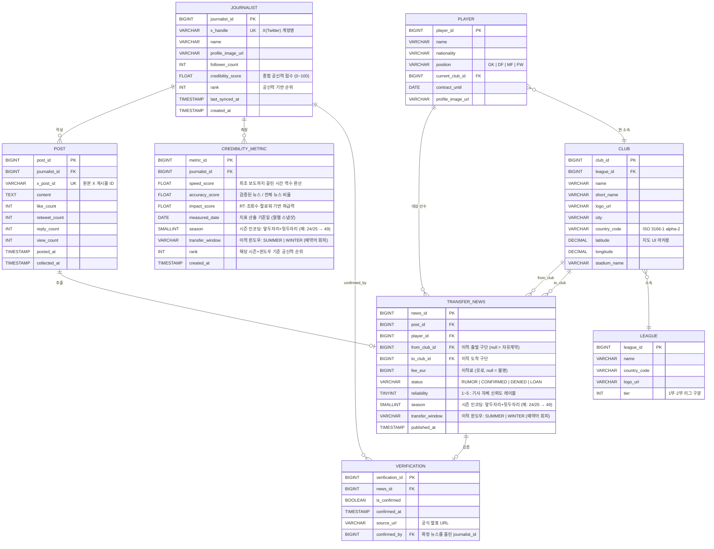

# E-R Diagram

## Concept
해외축구 이적시장 소식을 X(트위터)의 고신뢰 기자 게시물로 수집하고,
기사 등록 속도·정확도·파급력 기반으로 기자 공신력을 산출하여 유럽 지도 UI에 제공하는 서비스.

---



---

## 핵심 비즈니스 규칙

| 규칙 | 설명 |
|------|------|
| 공신력 점수 산출 | `credibility_score = speed_score × 0.3 + accuracy_score × 0.5 + impact_score × 0.2` (가중치는 조정 가능) |
| 정확도 측정 기준 | `TRANSFER_NEWS.status`가 `CONFIRMED`이고 `VERIFICATION.is_confirmed = true`인 건수 / 전체 뉴스 건수 |
| 속도 점수 | 동일 선수의 이적 루머 중 가장 먼저 `POST.posted_at`이 기록된 기자에게 높은 점수 부여 |
| 파급력 점수 | `(retweet_count × 3 + like_count + view_count × 0.1) / follower_count` 정규화 |
| 지도 UI | `CLUB.latitude` / `CLUB.longitude` 기준으로 유럽 지도 마커 렌더링, `to_club_id` 기준 이동 경로 시각화 |
| 자유계약 이적 | `TRANSFER_NEWS.from_club_id = NULL`, `fee_eur = 0` |
| 시즌 인코딩 | `season = 앞두자리 + 뒷두자리` — 24/25 → 49, 25/26 → 51. 2씩 증가하는 홀수 패턴으로 고유값 보장. 현재 시즌 조회 시 `WHERE season = 49` |
| 이적 윈도우 | `SUMMER`: 6~9월 (시즌 시작 전 여름), `WINTER`: 1~2월 (시즌 중반 겨울). 동일 시즌(49)에 두 윈도우가 모두 존재. `published_at` 월 기준으로 자동 분류 가능 |
| 시즌별 기자 랭킹 | `CREDIBILITY_METRIC.rank` — 특정 `season + window` 조합 기준 순위. `JOURNALIST.rank`는 가장 최근 스냅샷 캐시값 |
```
